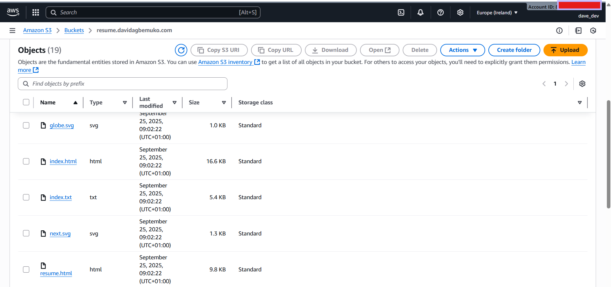
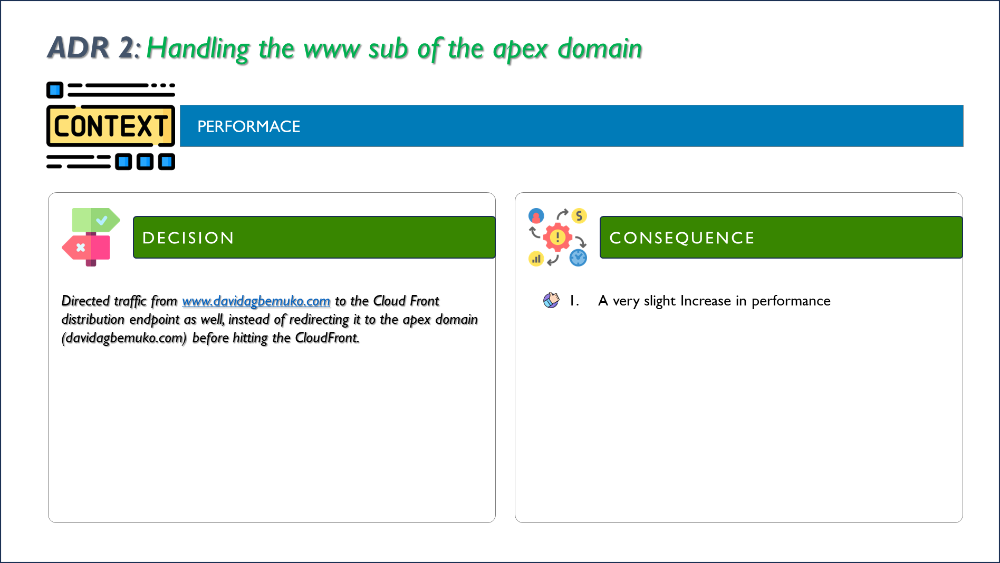
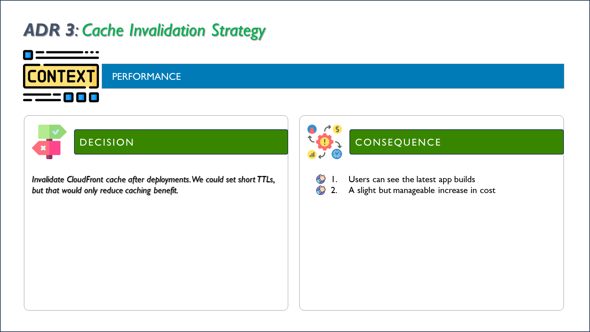

# Portfolio Website - README

https://davidagbemuko.com

## Table of Contents
- [Overview](#overview)
- [Key Features](#key-features)
- [Technology Stack](#technology-stack)
- [Architecture](#architecture)
- [Deployment Strategy](#deployment-strategy)
- [CI/CD Workflow](#cicd-workflow)


## Overview
This project implements a frontend website as part of my Cloud Resume Challenge. The website serves as the presentation layer, providing a clean and responsive user interface to display my resume and interactive features. It is designed with modern frontend development practices and integrates with cloud-based backend services to meet the full-stack requirements of the challenge.

## Key Features  

- **Cloud Integration:** The website is hosted on an **Amazon S3 bucket** and served through **AWS CloudFront** for secure, low-latency global distribution. It connects to a backend service built on an **AWS serverless architecture**.  
- **Visitor Counter:** Displays a **dynamic visitor count**, retrieved via a public API exposed through **AWS API Gateway** and powered by serverless compute with persistent storage.  
- **CI/CD Pipeline:** Implements an **automated deployment pipeline**, ensuring changes are delivered with **speed, repeatability, and reliability**.  

---

## Technology Stack

This project is built using the following stack:

- **Frontend:** [Next.js]
- **Build Tool:** [Vite](https://vitejs.dev/) for fast development and optimized production builds
- **Route 53:** to serve as the **DNS hosted zone**, and manage the authoritative name servers for my domain
- **ACM Certificate:** Provides an **SSL/TLS certificate** via **AWS Certificate Manager (ACM)** to enable secure HTTPS communication for the website.  
- **CloudFront Distribution:** Acts as a **content delivery network (CDN)** to cache and distribute content globally with low latency, while also integrating with ACM to enforce HTTPS.  
- **GiHub Actions:** to achieve continous deployment
- **Package Management:** [npm](https://www.npmjs.com/)

---
## Architecture Design
- **Provider:** AWS
- **Resources:** S3 Bucket, IAM Policy, AWS CloudFront, ACM Certificate, Route 53


---

## Deployment Strategy

### Prerequisites
Before deploying, ensure you have:
- An AWS account with permissions for S3, CloudFront, Route 53, and ACM.
- A registered domain (e.g., `davidagbemuko.com`).
- Node.js and npm installed locally.

The website is deployed using **Amazon S3 + CloudFront + Route 53** for static hosting and secure delivery:

- **Build:** The React app is built using `npm run build`, generating static files in the `out` (or `build`) directory.
- **Upload:** The contents of the `out/` folder are uploaded to an S3 bucket (via AWS Console, CLI, or CI/CD).
- **Configuration:** 
  - The S3 bucket remains private with **Block Public Access** enabled.
  - CloudFront is used to serve the files securely via HTTPS.
  - The CloudFront distribution is configured with:
    - **Origin Access Control (OAC)** to read from the bucket
    - **Default Root Object** set to `index.html`
    - An **ACM certificate** for HTTPS
- **Domain Integration:** Route 53 provides DNS with alias records (`A`/`AAAA`) pointing the domain to CloudFront.

**Steps:**
1. Build the project:  
   ```bash
   npm run build
2. Upload the build output (out/) to s3:
    - the bucket is not configured for a website endpoint to enforce security. instead, the rest endpoint of the bucket is used.
    - also, the bucket is configured **private** so only the cloudfront distribution can serve the files securely via HTTPS
    
3. Configure CloudFront:
    - set origin to the s3 REST endpoint (**to enforce security**)
    - Attach OAC (Origin Access Control) and update **bucket policy**
    - Set index.html as the default root object (this is important: else, it reads access denied!)
    - Attach ACM certificate for HTTPS
    
    
4. Update Route 53:
    - point your domain names to the CloudFront distribution (e.g. davidagbemuko.com and www.davidagbemuko.com)
    
5. (Optional) Invalidate CloudFront cache for specific files to allow fresh servings by the cloud front
    
---

## CI/CD Workflow

A CI/CD pipeline helps automate build and deployment:

- **Continuous Integration:** On every push to `main`, GitHub Actions runs tests and builds the project.
- **Continuous Deployment:** If the build succeeds, the workflow syncs the `out` folder to the S3 bucket using AWS CLI.

**Sample Workflow Steps:**
1. Checkout code
2. Install dependencies (`npm install`)
4. Build project and export (`npm run build`)
5. Deploy to S3 (`aws s3 sync dist/ s3://your-bucket-name/ --delete`)

**Possible Pitfalls & Solutions:**
- **AWS Credentials:** Ensure secrets are securely stored (e.g., GitHub Secrets) and have minimal permissions.
- **Build Failures:** Monitor workflow logs and set up notifications for failed builds.
- **Bucket Permissions:** Avoid making the bucket fully public; use bucket policies to restrict access as needed.


---
## Architecture Decision Records
1. Decision Record 1

2. Decision Record 2

3. Decision Record 3


---
## Summary

This portfolio website leverages a modern React stack, is deployed as a static site on AWS S3, and uses a robust CI/CD pipeline for automated builds and deployments.